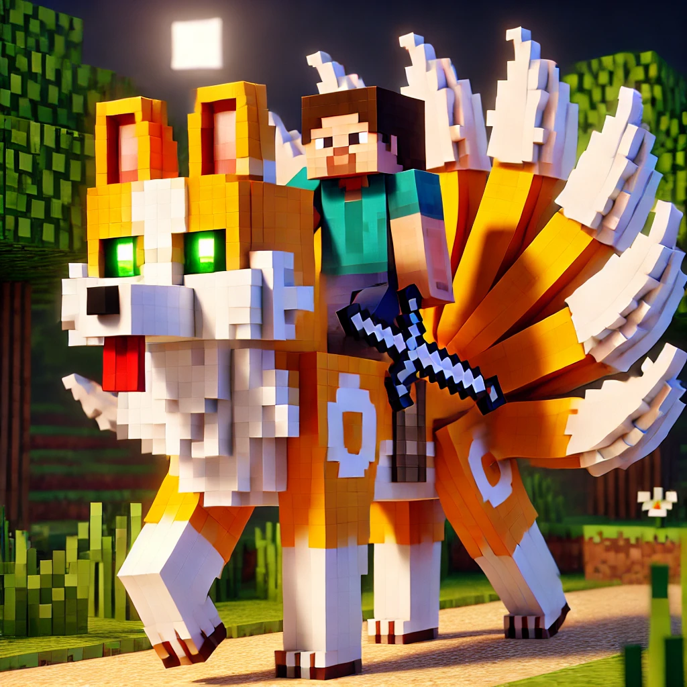

<div style="text-align: center;">
    
</div>

# Mounts
This plugins requires the following to run since it's built with its functionality in mind:

## Usage
This adds a command to auto-mount a MythicMob and works well with custom models.
This is intended to make it easy to mount and dismount a cosmetic pet.

## Dependencies
- [HeavenLibrary](https://modrinth.com/plugin/heavenlibrary)
- [MythicMobs](https://modrinth.com/plugin/mythicmobs)

Make sure to use these when running this plugin.

## Commands
- `/mount <mob>` Summons and auto-mounts the MythicMob.

## New MythicMob Triggers
- `~onMount` Triggers when you mount on an entity.
- `~onUnmount` Triggers when you dismount from an entity. 

## Example MythicMob File
```YAML
Kitsune_Inferno:
  Type: WOLF
  Display: '&cInferno Kitsune'
  Health: 100
  Damage: 7
  Faction: Mounts
  Options:
    MovementSpeed: 0.26
    PreventRandomEquipment: true
    Persistent: false
    Despawn: true
    Tameable: true
    Silent: true
    FollowRange: 40
    PreventLeashing: false
  Skills:
    - model{mid=kitsune_inferno;step=1;drive=true} @self ~onSpawn
    - effect:sound{s=entity.fox.ambient;volume=0.7;pitch=1} @self ~onTimer:220 0.4
    - mountmodel{mid=kitsune_inferno;driver=true;force=true;delay=1} @Trigger ~onMount
    - remove @Self ~onUnmount
```
*Remember to delay the `mountmodel` mechanic by at least 1 tick or else it will visually fail.*